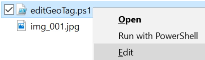
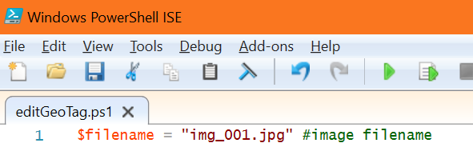
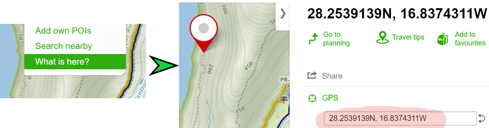
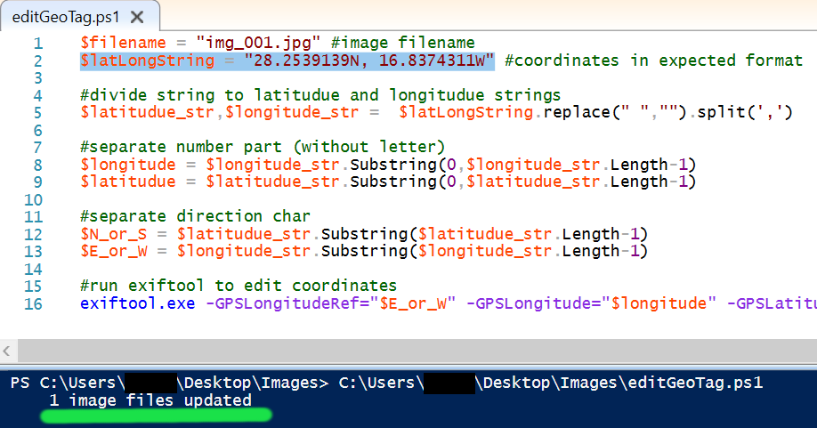

# Why?

I just needed to edit (add) GPS coordinates of some photos without unnecessarry effort (raw exiftool) and with GPS format that matches my favorite [maps](https://en.mapy.cz/turisticka).

# Requirements

- exiftool installed

  - via chocolatey: `choco install exiftool`
  - or http://owl.phy.queensu.ca/~phil/exiftool/

# Hot to use it (on Windows)

1. Place the `editGeoTag.ps1` script to the same folder as images you want to edit the geotag.

2. Open the script in Windows PowerShell ISE by selecting *Edit*

3. Edit `$filename` variable to match selected image.

4. Copy coordinates from maps. I recommend tourist variant of [mapy.cz](https://en.mapy.cz/turisticka)

5. Paste coordinates to `$latLongString` variable.

6. Press F5 to run the script. This is expected result:

## PowerShell and F#

F# version works same, but needs also F# installed. PowerShell script is more straightforward.